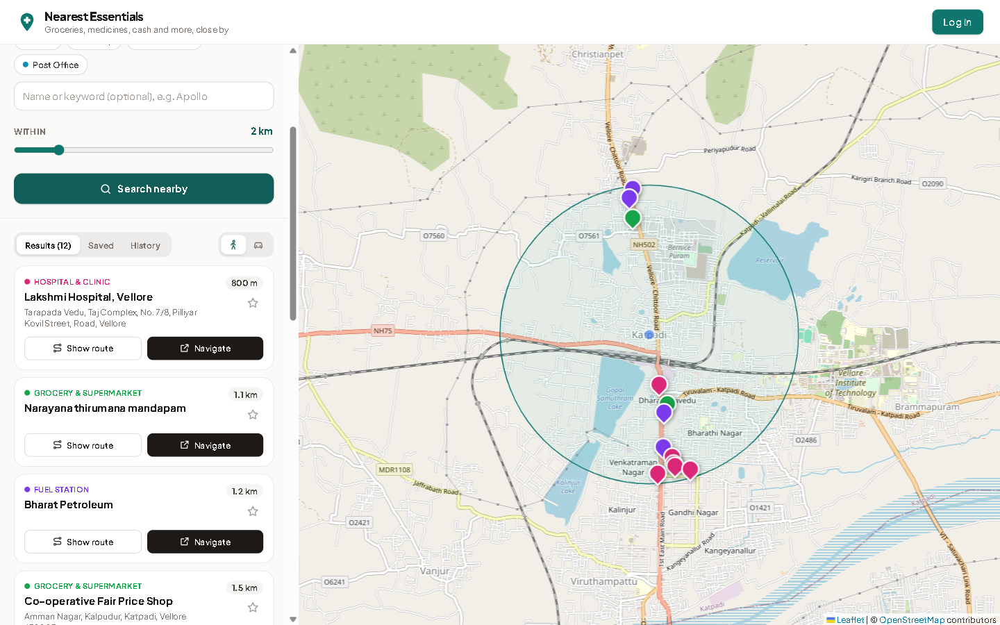
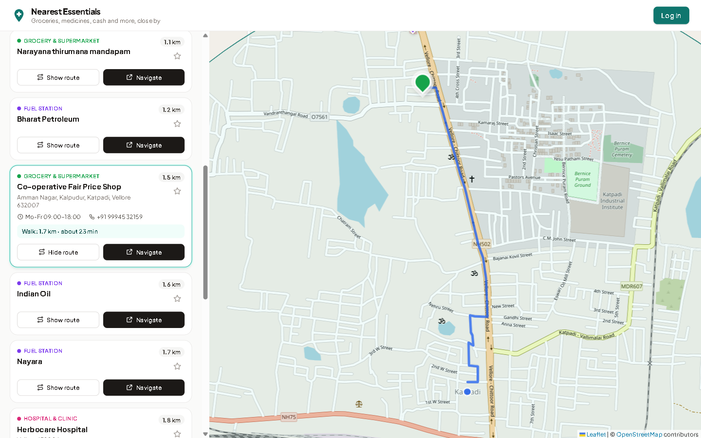

# Nearest Essentials Finder

A full-stack web app that helps you find **essential shops and services near you**: grocery stores, pharmacies, hospitals and clinics, ATMs, banks, bakeries, fuel stations and post offices.

You share your location (or type an area, or click on the map), pick what you need and how far you're willing to go, and the app shows the nearest places on a map and in a list, **sorted by distance**. You can draw the walking or driving route to any place, open turn-by-turn navigation, and, after signing up, save your go-to places and re-run past searches.

**Tech stack:** Java 17 · Spring Boot 3 · Spring Data JPA · MySQL · REST APIs · React 19 · Vite · Tailwind CSS · Leaflet · OpenStreetMap





---

## Features

- **Find nearby essentials** in 8 categories, or all of them at once
- **Three ways to set your location**: GPS ("My location"), typing an area name, or clicking the map
- **Adjustable search radius** from 0.5 km to 10 km, plus an optional keyword filter (for example "Apollo")
- **Results sorted by real distance**, showing address, opening hours and phone number when known
- **Interactive map** with colour-coded pins and the search circle
- **Routes in the app**: walking or driving path drawn on the map, with distance and estimated time
- **Navigate** button that opens Google Maps turn-by-turn directions
- **User accounts** (sign up / log in) with **saved places** and **search history**
- **Works on phones and desktops** (responsive layout)
- **Free map data**: everything comes from OpenStreetMap, so no paid API key is needed

---

## How it works (the basics)

The project has two separate programs that talk to each other over HTTP:

```
 ┌──────────────────────────┐      JSON over HTTP      ┌────────────────────────────┐
 │  Frontend (React)        │  ─────────────────────►  │  Backend (Spring Boot)     │
 │  runs in the browser     │  ◄─────────────────────  │  REST API on port 8080     │
 │  map, search form, list  │   GET /api/places/nearby │                            │
 └──────────────────────────┘                          │  ┌──────────┐  ┌─────────┐ │
                                                       │  │  MySQL   │  │  OSM    │ │
                                                       │  │ database │  │ (live)  │ │
                                                       │  └──────────┘  └─────────┘ │
                                                       └────────────────────────────┘
```

- **Frontend** = what you see. A React app that draws the map, the search form and the results.
- **Backend** = the brain. A Spring Boot server that exposes **REST APIs**: URLs such as `/api/places/nearby` that return data as JSON.
- **Database** = the memory. MySQL stores places, users, saved places and search history.
- **OpenStreetMap (OSM)** = the source of map data. It's a free, community-built map of the world, like Wikipedia for maps.

### What happens when you press "Search nearby"

1. The React app calls `GET /api/places/nearby?lat=12.97&lng=79.13&radiusKm=2&category=PHARMACY`.
2. The backend checks whether it has **already downloaded** pharmacies for this area in the last 24 hours (the `synced_areas` table).
   - **No:** it asks OpenStreetMap's **Overpass API** once for every pharmacy in that circle and saves them in MySQL.
   - **Yes:** it skips that step, so repeat searches are fast and OpenStreetMap isn't hit again.
3. It reads candidate places from MySQL using a **bounding box** (a lat/lng rectangle around the circle). That query is quick because the columns are indexed.
4. For each candidate it calculates the exact distance with the **Haversine formula**, which measures distance on a sphere. It drops places outside the circle, applies the keyword filter, and **sorts nearest first**.
5. If you're logged in, it marks which results you've saved and records the search in your history.
6. The React app receives the JSON and draws the pins and cards.

If OpenStreetMap is slow or down, the backend still answers from places already in the database and shows a short notice. It never crashes.

### Login, kept simple

When you sign up, the password is hashed with **BCrypt**, so only the hash is stored. The server then creates a long random **token** and saves it in the `auth_tokens` table. The browser keeps the token and sends it with every request as `Authorization: Bearer <token>`. A small resolver (`@CurrentUser`) turns that header back into the logged-in user for any endpoint that needs one.

---

## Project structure

```
Nearest_Essentials_finder/
├── backend/                     Spring Boot REST API
│   ├── pom.xml                  Maven dependencies
│   ├── mvnw, mvnw.cmd           Maven wrapper (no Maven install needed)
│   └── src/main/java/com/codexaniket/essentials/
│       ├── controller/          REST endpoints (PlaceController, AuthController, UserDataController)
│       ├── service/             Business logic (search, sync with OSM, auth, favourites, history)
│       ├── repository/          Spring Data JPA interfaces for talking to MySQL
│       ├── model/               JPA entities = database tables (Place, AppUser, Favorite, ...)
│       ├── dto/                 Request/response objects sent as JSON
│       ├── osm/                 Clients for OpenStreetMap (Overpass + Nominatim)
│       ├── auth/                @CurrentUser annotation + resolver
│       ├── config/              CORS, HTTP client, typed settings
│       ├── exception/           One place that turns errors into clean JSON
│       └── util/GeoUtils.java   Haversine distance + bounding box maths
│
├── frontend/                    React + Vite + Tailwind CSS
│   └── src/
│       ├── App.jsx              Page layout and app state
│       ├── api.js               All calls to the backend (and the routing service)
│       ├── utils.js             Distance/time formatting, directions link
│       └── components/          Header, SearchPanel, MapView, PlaceCard, AuthModal, HistoryList
│
├── legacy/                      The first version (a single Google Maps HTML page)
└── docs/                        Screenshots for this README
```

---

## REST API

| Method | Endpoint | What it does | Login? |
|---|---|---|---|
| GET | `/api/health` | Is the server running? | No |
| GET | `/api/categories` | List of categories with labels and colours | No |
| GET | `/api/places/nearby` | Nearby search (params below) | Optional |
| GET | `/api/places/{id}` | One place by id | Optional |
| GET | `/api/geocode?q=Katpadi Vellore` | Turn typed text into coordinates | No |
| POST | `/api/auth/register` | Create an account `{name, email, password}` | No |
| POST | `/api/auth/login` | Log in `{email, password}`, returns a token | No |
| POST | `/api/auth/logout` | End the current session | Yes |
| GET | `/api/auth/me` | Who am I? | Yes |
| GET | `/api/me/favorites` | My saved places | Yes |
| POST | `/api/me/favorites/{placeId}` | Save a place | Yes |
| DELETE | `/api/me/favorites/{placeId}` | Un-save a place | Yes |
| GET | `/api/me/searches` | My last 20 searches | Yes |
| DELETE | `/api/me/searches` | Clear my search history | Yes |

**`/api/places/nearby` parameters**

| Param | Required | Default | Notes |
|---|---|---|---|
| `lat`, `lng` | yes | | Where to search from |
| `radiusKm` | no | `2` | 0.2 to 10 |
| `category` | no | all | `GROCERY`, `PHARMACY`, `HOSPITAL`, `ATM`, `BANK`, `BAKERY`, `FUEL`, `POST_OFFICE` |
| `q` | no | | Keyword matched against name and address |
| `limit` | no | `60` | Max results (1 to 200) |
| `label` | no | | Readable location name, only stored in history |

Example response (trimmed):

```json
{
  "latitude": 12.9692, "longitude": 79.1559, "radiusKm": 2.0, "count": 2, "notice": null,
  "places": [
    { "id": 2, "name": "Saravana Pharmacy", "category": "PHARMACY", "categoryLabel": "Pharmacy",
      "latitude": 12.97284, "longitude": 79.15834, "distanceKm": 0.48, "favorite": false,
      "address": null, "phone": null, "openingHours": null, "website": null }
  ]
}
```

Errors always come back in the same shape, for example `{"status": 400, "error": "Bad Request", "message": "radiusKm must be less than or equal to 10"}`.

---

## Database tables

Hibernate creates these automatically from the `@Entity` classes on first start.

| Table | Holds |
|---|---|
| `places` | Every shop or service downloaded from OpenStreetMap: name, category, lat/lng, address, phone, hours. Indexed on `(category, latitude, longitude)`. |
| `synced_areas` | Which circles were downloaded for which category and when. This is the cache. |
| `users` | Name, email and BCrypt password hash |
| `auth_tokens` | Login sessions (token → user, expiry date) |
| `favorites` | Which user saved which place |
| `search_history` | Each search made by a logged-in user |

---

## Running it locally

### What you need

- **Java 17 or newer** (`java -version`)
- **Node.js 20 or newer** (`node -v`)
- **MySQL 8**, running locally. You can skip it at first: see [Try it without MySQL](#try-it-without-mysql).

Maven itself is **not** needed: the project includes the Maven wrapper (`mvnw`).

### 1. Start the backend

The database `essentials_finder` is created automatically on first run. Tell the app your MySQL username and password using environment variables:

**Windows (PowerShell)**
```powershell
cd backend
$env:DB_USERNAME="root"; $env:DB_PASSWORD="your_mysql_password"
.\mvnw.cmd spring-boot:run
```

**macOS / Linux**
```bash
cd backend
DB_USERNAME=root DB_PASSWORD=your_mysql_password ./mvnw spring-boot:run
```

When you see `Started EssentialsFinderApplication`, check it at http://localhost:8080/api/health.

### 2. Start the frontend

In a second terminal:

```bash
cd frontend
npm install
npm run dev
```

Open **http://localhost:5173**. Allow location access, or type an area such as "Katpadi, Vellore", and search.

> The first search in a new area downloads live data from OpenStreetMap and can take a few seconds. Searches in the same area after that come straight from MySQL.

### Try it without MySQL

There's an `h2` profile that uses an in-memory database instead (data is lost when you stop the server):

```bash
cd backend
./mvnw spring-boot:run -Dspring-boot.run.profiles=h2
```

### Run the tests

```bash
cd backend
./mvnw test
```

The tests use an in-memory database and a fake OpenStreetMap, so they need no internet or MySQL. They cover distance maths, the Overpass query builder, sorting and radius filtering, validation errors, the full sign-up → save → history → logout flow, and the "download once, then serve from the database" caching.

### Settings

All settings can be overridden with environment variables:

| Variable | Default | Meaning |
|---|---|---|
| `DB_URL` | `jdbc:mysql://localhost:3306/essentials_finder?createDatabaseIfNotExist=true...` | MySQL connection |
| `DB_USERNAME` / `DB_PASSWORD` | `root` / *(empty)* | MySQL login |
| `PORT` | `8080` | Backend port |
| `CORS_ORIGINS` | `http://localhost:5173,...` | Which frontend URLs may call the API |
| `OSM_ENABLED` | `true` | Turn live OpenStreetMap lookups on or off |
| `OVERPASS_URLS` | overpass-api.de, overpass.private.coffee | Overpass servers, tried in order |
| `VITE_API_URL` (frontend) | *(empty)* | Backend URL if it's on another domain (see `frontend/.env.example`) |

---

## Data sources and credits

- Map tiles and place data: © [OpenStreetMap](https://www.openstreetmap.org/copyright) contributors
- Place search: [Overpass API](https://wiki.openstreetmap.org/wiki/Overpass_API)
- Typed-location search: [Nominatim](https://nominatim.org/)
- In-app routes: [OSRM](https://project-osrm.org/) servers hosted by [FOSSGIS / openstreetmap.de](https://routing.openstreetmap.de/)
- Map library: [Leaflet](https://leafletjs.com/) via [React Leaflet](https://react-leaflet.js.org/)

These are free public services with fair-use limits, fine for a student project or demo. A heavily used deployment should run its own Overpass/OSRM instance or use a paid provider.

---

## Legacy version

The [`legacy/`](legacy) folder holds the first version of this project: one HTML page that called the Google Maps Places API directly from the browser. It had no backend, database or user accounts. The current version replaced it with a proper client–server design and free OpenStreetMap data.

## Ideas for later

- "Open now" filter by parsing OpenStreetMap `opening_hours`
- Let users add or correct places missing from the map
- Ratings and short reviews for saved places
- Docker Compose file to start MySQL, the backend and the frontend with one command
